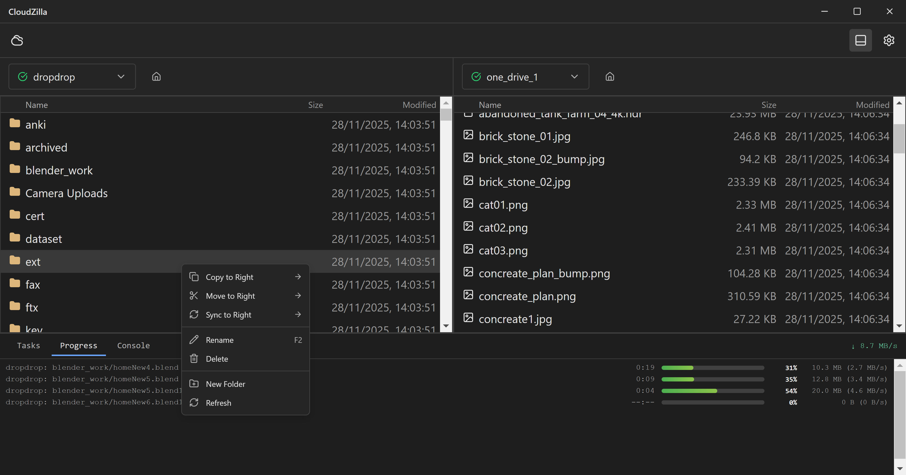

# CloudZilla

[English](README.md) | [繁體中文](README.zh-TW.md)

跨平台雲端檔案管理工具，輕鬆管理多個雲端儲存服務。

## 功能特色

- **多雲端支援**：連接 Dropbox、Google Drive 和 OneDrive
- **統一介面**：在同一個地方瀏覽和管理所有雲端檔案
- **檔案傳輸**：在不同雲端服務之間複製和移動檔案
- **進度追蹤**：即時顯示傳輸進度、速度和預估時間
- **雙語介面**：支援英文和繁體中文

## 快速開始

```bash
# 1. 複製專案並安裝
git clone https://github.com/meowhoo/cloudzilla.git
cd cloudzilla
npm install

# 2. 執行應用程式
npm start
```

## 首次設定

啟動應用程式後：

1. 點擊側邊欄的 **「新增站台」**
2. 選擇您的雲端服務（Google Drive、Dropbox 或 OneDrive）
3. 依照 OAuth 授權流程操作
4. 您的雲端儲存空間將顯示在側邊欄

## 截圖



[查看更多截圖](screenshots/screenshot02.png)

## 系統需求

- Node.js 18+
- npm 9+
- Windows（macOS / Linux 規劃中）

## 技術架構

- **框架**：Electron 28
- **前端**：React 18 + TypeScript
- **雲端後端**：rclone（內建）
- **打包工具**：Webpack（透過 Electron Forge）
- **國際化**：react-i18next

## 專案結構

```
cloudzilla/
├── packages/
│   └── gui/                 # Electron 應用程式
│       ├── src/
│       │   ├── main/        # 主程序（Node.js）
│       │   ├── renderer/    # React 前端
│       │   └── preload/     # 預載腳本
│       └── resources/
│           └── bin/         # rclone 執行檔
├── package.json
└── README.md
```

## 開發指令

```bash
# 開發模式執行
npm start

# 程式碼檢查
npm run lint

# 修正程式碼風格
npm run lint:fix

# 清理打包產出
npm run clean
```

## 打包

```bash
# 打包應用程式
cd packages/gui
npm run package

# 建立安裝程式
npm run make
```

## 授權條款

MIT
